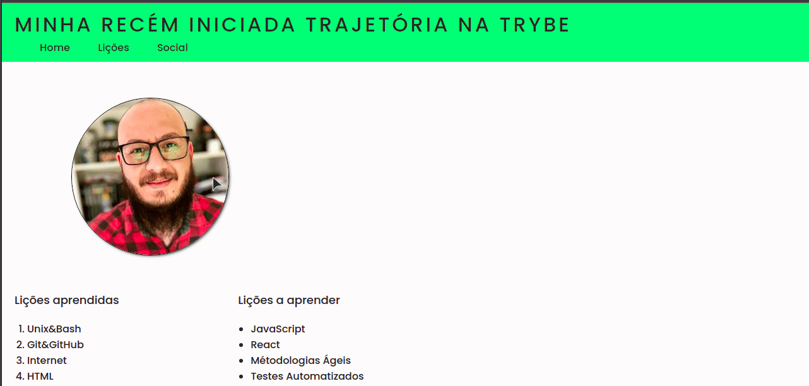

<h1 align="center">
    
</h1>

## **SOBRE**
Primeiro projeto criado dentro do módulo de Fundamentos na **Trybe**.
Objetivo principal era criar uma página contando um pouco dos primeiros passos dentro da Trybe, o que estava achando e o que esperar do futuro.

### **Habilidades**
- Utiizar HTML para construir páginas WEB.
- Utilizar HTML semântico para tornar sua páigna mais - acessível e melhor ranqueada.
- Utilizar CSS para adicionar estilo e posicionar elementos.

### **TÉCNOLOGIAS UTILIZADAS**
- HTML
- CSS

